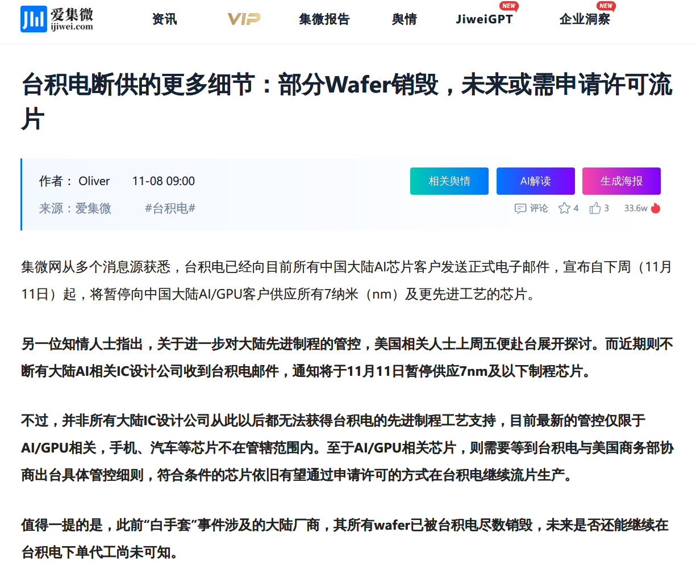
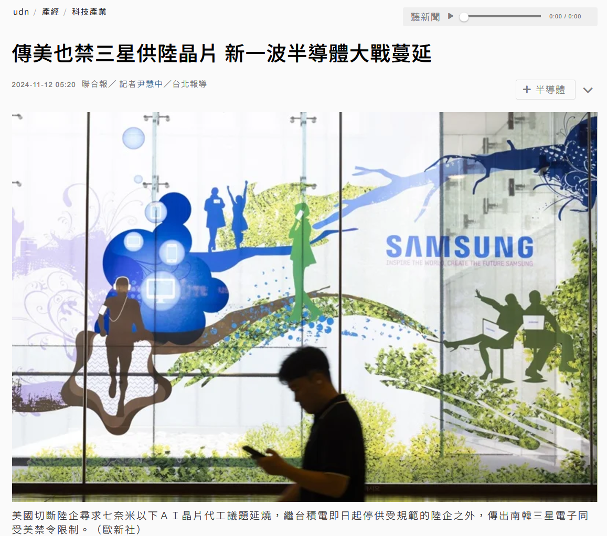
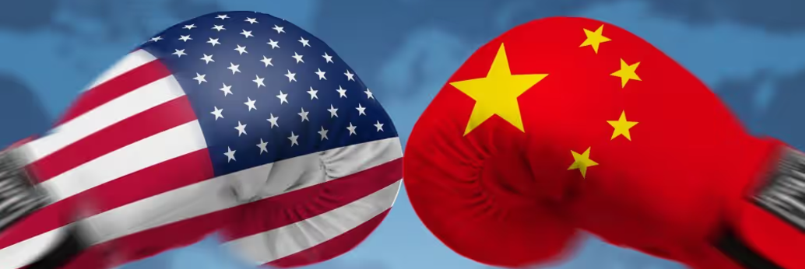
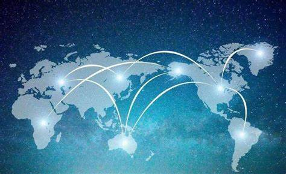

{
    "author": {
        "name": "丁宏阳",
    },
    "departments": [
        {
            "name": "杭州电子科技大学",
            "url": "https://www.hdu.edu.cn/",
            "img": "./static/hdu.png"
        }
    ]
}

+++++

# 中美最新"芯片之争"的马原视角

---

# News

----

## [台积电停供中国大陆7nm及以下AI芯片](https://www.ijiwei.com/n/922376)

- 近日，据外媒爆料，全球领先的半导体制造企业台积电（TSMC）已要求其在中国大陆的所有AI和GPU芯片客户，自2024年11月11日起，**全面暂停**供应所有7纳米（nm）及更先进工艺的芯片。
--
- 知情人士透露，美国商务部致信台积电，对运往中国、为人工智能加速器和图形处理单元 (GPU) 提供动力的某些 7 纳米或更先进设计的尖端芯片实施**出口限制**。
--
- 对此，台积电11月8日回应称，不评论市场传闻。台积电强调，公司作为一家守法的公司，一向致力于遵循所有可适用的法令与法规，**包括可适用的出口管制法规**。
--
- 采取这一行动之际，美国共和党和民主党议员都对中国出口管制以及商务部执行**力度不足**表示**担忧**。

---

## 矛盾无处不在，无时不有

- 根据台湾《经济日报》的报道，三星的晶圆代工部门已向客户发布通知，宣布将暂停接受中国大陆市场的7纳米及以上制程技术的订单
- 这一决定与台积电此前的类似举措相**呼应**，后者也因美国法规，停止向中国大陆的非消费类AI芯片客户供应7纳米制程产品。
- 这一系列举动可能意味着两家公司都在加强客户审核，以应对潜在的市场变化和风险。

----

## 矛盾具有普遍性

- 三星和台积电响应美国政策对华做出一定限制的原因可以从以下几个方面来理解：
    1. 美国在全球半导体供应链中占据着关键的技术和设备供应位置，即使像台积电和三星这样的巨头也依赖于美国的技术和工具。
    2. 对于台积电和三星来说，虽然中国市场非常重要，但它们不能忽视美国市场的巨大影响力以及与美国政府保持良好关系的重要性。
    3. 台积电和三星作为全球领先的半导体制造商，必须确保其供应链的安全性和稳定性。
    4. 作为跨国公司，它们有义务遵守所在国家和地区的法律法规。
--
- 两家企业的行为体现了矛盾的普遍性——即在全球化进程中，各国企业既要面对来自不同国家政策的影响，又要根据自身的利益和发展需求做出相应的调整。

----

## 矛盾具有特殊性

三星和台积电选择对华做出**特定限制**的原因可以归结为几个具体的、特殊的因素:

- 美国政策: 美国政府通过一系列出口管制法规，特别是针对中国的《实体清单》和其他相关措施，严格限制了向中国出口某些先进技术和产品的能力。

++++

## 中美科技竞争:

- 人工智能、5G通信等领域被视为未来科技发展的关键方向，而中国在这些领域的快速发展引起了美国的关注和警惕。
- 美国政府声称，限制对中国的技术出口是为了保护“国家安全”。这种说法虽然存在争议，但在当前的政治氛围中，它确实成为了推动相关政策的重要理由之一。

++++

## 企业商业决策

- 尽管中国市场非常重要，但台积电和三星在全球范围内拥有广泛的客户基础。为了避免因违反美国法规而失去其他重要市场或合作伙伴，它们选择了暂时对中国大陆的部分客户提供有限制的服务。
- 通过遵循美国的规定，台积电和三星可以在更大程度上掌控自己的供应链，避免不必要的风险。

---

## 对立统一

对立统一规律是事物发展的根本规律，矛盾双方既对立又统一，由此推动事物的运动、变化和发展。

--
- 当前中国国内的AI芯片行业相对混乱，众多初创公司抢占风口，既不掌握核心技术，也没有锻炼自己的能力，更无法抵抗政治风险。
--
- 美国的禁令卡死一批赖于充数的AI芯片公司，反而有利于真正立足于本土技术和本土制造的AI芯片公司成长，美国的禁令反而可以起到去伪存真的作用。
--
- 中芯国际作为国内领先的芯片制造企业，虽然在制程工艺上与台积电存在差距，但一直在努力追赶。近年来，中芯国际在技术研发和产能扩张方面取得了显著进展，逐渐缩小了与国际先进水平的差距。台积电停供的决定，为中芯国际等国内企业提供了更多的市场空间和发展机会。

----

## 否定之否定

根据辩证法中的否定之否定规律，事物的发展不是简单的直线前进，而是通过肯定、否定再到否定之否定的过程呈现出波浪式前进或螺旋式上升的总趋势。

- **肯定阶段(过去)**: 在这一阶段，台积电和三星作为全球领先的半导体制造商，与包括中国大陆在内的多个国家和地区保持着紧密的合作关系。中国企业能够获得最先进制程的芯片支持，促进了自身的科技进步，并在全球市场上占据了重要位置。
- **否定阶段(当今)**: 随着中美科技竞争加剧，美国开始实施一系列出口管制措施，限制中国获取最先进半导体技术的能力。这迫使台积电和三星对中国大陆的部分客户提供有限制的服务，打破了原有的合作模式。这种外部压力将激发中国加大对于自主研发的支持力度。中芯国际等国内企业将得到更多政策扶持和发展机遇，逐步提升自身技术水平，缩小与国际领先水平之间的差距。

++++

- **否定之否定(未来)**: 但长远而言，全球半导体产业将会形成更加**多元化**的格局:
    - 一方面，中国企业会寻找替代供应渠道或建立自有生产能力
    - 另一方面，台积电、三星等跨国公司也会探索新的商业模式和技术路径，以适应变化后的市场环境
    - 最终，国际社会将认识到过度单边主义和技术封锁不利于全球科技进步和经济发展。因此，各方有望加强对话沟通，共同制定更为合理透明的国际贸易规则，促进全球半导体产业健康稳定发展。

---

# 谢谢! ☝🤓
